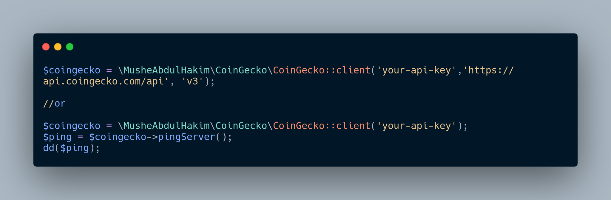

<div align="center">

    <p align="center">
        <a href="https://github.com/MusheAbdulHakim//actions"></a>
        <a href="https://packagist.org/packages/musheabdulhakim/coingecko"></a>
        <a href="https://packagist.org/packages/musheabdulhakim/coingecko"></a>
        <a href="https://packagist.org/packages/musheabdulhakim/coingecko"></a>
    </p>
</div>

------
This package provides a wonderful **PHP API** client that allows you to interact
with [CoinGecko Api](https://docs.coingecko.com/reference/introduction)


**This SDK** is a PHP & Laravel Package, (Designed to help working with coingecko api easier and faster).

## Requirement
> **Requires [Composer](https://getcomposer.org/)**
> **Requires [PHP 8.2+](https://php.net/releases/)**

<a name="Installation"></a>
## Installation

```bash
 composer require musheabdulhakim/coingecko
```

## Basic usage

```php
$coingecko = \MusheAbdulHakim\CoinGecko\CoinGecko::client('your-api-key');

//or 

$coingecko = \MusheAbdulHakim\CoinGecko\CoinGecko::client('your-api-key','https://api.coingecko.com/api', 'v3');
```

### Example
```php
$coingecko = \MusheAbdulHakim\CoinGecko\CoinGecko::client('your-api-key');
$ping = $coingecko->ping();

$pingTest = $ping->ping();

//or

$coingecko->pingServer();

```

### Configuration
Update api version, base url and api key
```php

'COINGECKO_API_VERSION' => 'v3',

'COINGECKO_BASE_URI' => 'https://api.coingecko.com/api',

'COINGECKO_API_KEY' => 'xxxxxxxxxxxxxxxxxxxxxx',

```


### Ping

#### [ping](https://www.coingecko.com/api/documentations/v3#/ping/get_ping)

Check API server status

```php
$ping = $coingecko->ping();
```

## License

`musheabdulhakim/coingecko` is released under the MIT License. See the bundled [LICENSE](./LICENSE) for details.

## Contribution


🧹 Keep a modern codebase with **php-cs-fixer**:

```bash
composer lint
```

🚀 Run the entire test suite:

```bash
composer test
```

Report all your issues [Here](https://github.com/MusheAbdulHakim/CoinGeckoApi/issues)

All your pull requests are welcome :). 


